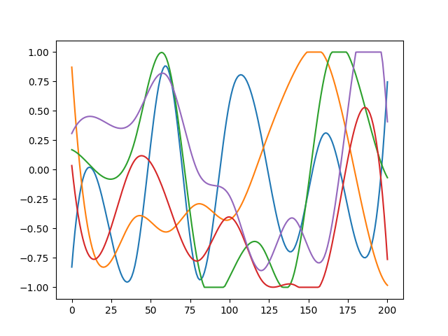

# Graph networks for learnable physical simulation

This repository is a partial implementation of [Graph networks as learnable physics engines for inference and control](https://arxiv.org/abs/1806.01242).

## Dependencies
 
- [DeepMind control suite](https://github.com/deepmind/dm_control)
- Mujoco
- networkx
- pytorch 0.4.1 (other versions untested)

## Generate data

Generate data with `gen_data.py` script, you should get control signals and resulting 6-link swimmers states.

## Train GN

Learn data distribution first with `python test_normalizer.py`. It will generate `normalize.pth`. Then run
`python train_gn.py` to train the model. The learning rate schedule corresponds to "fast training" in original paper.

## Evaluate GN

`python evaluate_gn.py <model path>`

